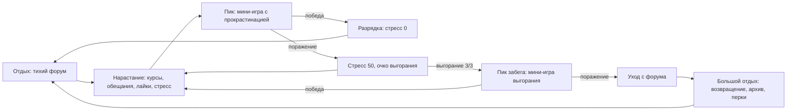

# Eternal Return — ГДД и роадмап

Версия 2, 24.09.2026. Заменяет `game-design-document.md` и `vision-and-roadmap.md` как основной документ, опирается на них.

---

# Часть 1. Гейм-дизайн документ

## 1. Концепция

**Жанр:** idle-roguelite.

**Платформа:** ПК (Windows), веб-демо.

**Питч:** человек вечно сидит на форуме. Даёт обещания, начинает курсы, срывается и уходит. Потом возвращается. Форум помнит всё.

**Тема:** безвыходность и очень тяжёлое преодоление.

**Тон:** тихая безнадёжность с горькой иронией. Подача держится на тексте форума: посты, подписи, реплики модераторов и незнакомцев.

**Целевое переживание:** игрок раз за разом собирается с силами, держится, срывается и возвращается. Каждое преодоление достаётся тяжело и потому ощущается заслуженным.

## 2. Главный принцип: ритм напряжения и отдыха

Каждый цикл игры строится на чередовании напряжения и отдыха. Механики существуют для того, чтобы создавать нарастание, пик, разрядку и отдых, и оцениваются по тому, насколько хорошо они это делают.

**Главный пик напряжения — мини-игра «Борьба с прокрастинацией».** Всё в забеге подводит к ней, после неё идёт разрядка.

Уровни ритма:

| Уровень | Длительность | Напряжение | Пик | Отдых |
|---|---|---|---|---|
| Микро | секунды | думскроллинг лайков, перегрев | блокировка лайков | ожидание, пока тикают курсы и созревают посты |
| Сегмент | 4–8 минут | рост стресса, дедлайн обещания | мини-игра с прокрастинацией | стресс сброшен, тишина форума |
| Забег | 20–40 минут | пики сегментов растут, передышки короче | мини-игра выгорания | экран ухода с форума |
| Мета | часы | каждое возвращение сложнее и глубже | финальный забег | архив форума, перки |

Правила ритма:
- **Пик нельзя отложить.** Стресс 100 запускает мини-игру сразу. Срыв наступает сам, как у героя.
- **Разрядка ощутима.** После победы: стресс обнуляется, звук затихает, 10–15 секунд новые источники стресса не работают.
- **Пики растут.** Каждая следующая мини-игра в забеге сложнее предыдущей.
- **Передышки короче.** К концу забега источники стресса сильнее, и фаза отдыха сжимается.

## 3. Мини-игры

### 3.1. «Борьба с прокрастинацией»

**Запуск:** стресс достигает 100. Остальная игра встаёт на паузу.

**Длительность:** 15–20 секунд.

**Правила:**
- В центре экрана шкала «Фокус». Она постоянно падает. Клики по кнопке «Работать» её поднимают.
- Вокруг всплывают отвлечения: вкладки, уведомления, сообщения форума. Их нужно закрывать, пока они не отняли фокус.
- Часть отвлечений — соблазны: «5 новых лайков», «тебе ответили». Клик по соблазну даёт мотивацию после мини-игры и сразу отнимает много фокуса.
- **Победа:** фокус продержался выше нуля до конца таймера.
- **Поражение:** фокус упал до нуля.

**Итог:**
- Победа: стресс 0, фаза разрядки.
- Поражение: стресс 50, +1 очко выгорания.

**Эскалация внутри забега:** с каждой следующей мини-игрой фокус падает быстрее, отвлечения появляются чаще, соблазны становятся сильнее.

**Реализация:** только uGUI, без арта. Кнопки, шкала, всплывающие окна в стиле форума.

### 3.2. Мини-игра выгорания

**Запуск:** очки выгорания достигают максимума (3).

Те же правила, что у борьбы с прокрастинацией, но жёстче: длиннее (30 секунд), фокус падает быстрее, есть отвлечения, которые нельзя закрыть и нужно переждать.

**Итог:**
- Победа: −1 очко выгорания, +1 очко продуктивности. Забег продолжается. Каждая следующая мини-игра выгорания в забеге сложнее.
- Поражение: герой уходит с форума, забег заканчивается.

## 4. Ресурсы

| Ресурс | Источники | Стоки | Максимум |
|---|---|---|---|
| Знания (Intel) | курсы, пассивно | сокеты, обещания, дневник, проект | 100, растёт перками |
| Мотивация | посты, заполнение лайков, соблазны в мини-игре | изучение идей, прокачка курсов, проект | 100 |
| Лайки | думскроллинг (клики) | заполнение: сброс в 0, +мотивация | 40 |
| Перегрев | каждый лайк | спадает со временем | 100 |
| Стресс | см. раздел 7 | мини-игра с прокрастинацией | 100 |
| Выгорание | поражение в мини-игре с прокрастинацией | победа в мини-игре выгорания | 3 |
| Продуктивность (мета) | конец забега, победы в мини-игре выгорания | перки | — |

## 5. Механики забега

### 5.1. Думскроллинг и перегрев

Кнопка лайков — чтение форума. Каждый клик: +1 лайк, +1 перегрев. Заполнение лайков даёт мотивацию и немного стресса. Перегрев 100 блокирует лайки, пока перегрев не спадёт до нуля. Это микроцикл: быстрое нарастание, вынужденная пауза.

### 5.2. Идеи

Кнопка «Думать» стоит мотивации. После ожидания появляется идея. Сбор идеи ставит курс в свободный сокет курсов. Получение идеи даёт стресс.

### 5.3. Курсы

- Пассивно приносят знания.
- **Прокачка:** уровень курса растёт за мотивацию в пределах тира. Даёт стресс.
- **Слияние:** два курса одного вида на максимальном уровне тира сливаются в курс следующего тира. Даёт стресс.
- Тиры 1–3. Каждый тир примерно удваивает доход знаний.

### 5.4. Сокеты

Слоты для курсов и для постов. Первый бесплатный, каждый следующий стоит 10 знаний. Максимум 10 каждого вида.

### 5.5. Посты (темы)

| Пост | Открытие | Правила |
|---|---|---|
| Рассказать про день | забег 1 | бесплатно, минута ожидания, +5 мотивации |
| Дать обещание | возвращение 1 | стоит знаний, раз в 10 минут. Герой обещает цель со сроком (например, «прокачаю курс до 3 уровня за 5 минут»). Выполнил: много мотивации и запись в архиве. Не выполнил: стресс и долг в архиве |
| Объявить дневник | возвращение 4 | долгая тема со здоровьем. Здоровье падает, его нужно поддерживать знаниями. Приносит пассивную мотивацию, стрик увеличивает прирост. Здоровье 0: дневник заброшен, стресс и запись в архиве |

Обещание — добровольное напряжение: игрок сам ускоряет нарастание ради большой награды.

### 5.6. Проект

Открывается на возвращении 2. Цель забега: шкала прогресса, которая заполняется знаниями и мотивацией. Работа над проектом даёт стресс. Завершение приносит признание форума, много продуктивности и запись в архиве. Проект — попытка героя сделать что-то настоящее, его содержание не уточняется.

## 6. Архив форума

Все посты, обещания, дневники и проекты прошлых забегов сохраняются в архиве. Архив виден на экране возвращения и во вкладке форума.

- **Выполненное обещание:** снижает стресс на старте следующего забега.
- **Брошенное обещание:** долг. Следующий забег начинается со стрессом, модератор напоминает о нём.
- **Завершённый проект:** постоянный бонус к мотивации.

**События форума** (случайные, раз в несколько минут):
- «Твой старый пост всплыл» — стресс или мотивация, в зависимости от поста.
- «Кто-то написал, что тоже сдался» — стресс.
- «Незнакомец поддержал» — мотивация.
- «Модератор напомнил про обещание» — стресс, если в архиве есть долг.

## 7. Стресс

Источники: получение идеи, прокачка курса, слияние курсов, заполнение лайков, блокировка лайков, брошенное обещание, события форума. Каждый источник даёт случайное количество в своём диапазоне.

Стресс не спадает сам. Единственный сток — победа в мини-игре. Поэтому каждое действие игрока приближает пик.

## 8. Конец забега и возвращение

1. Поражение в мини-игре выгорания: экран «Ушёл с форума», итог забега.
2. Все курсы конвертируются в продуктивность по уровню и тиру.
3. Экран возвращения: архив, перки, открытые механики, фраза «Снова здесь».
4. Сброс ресурсов, курсов и сокетов. Сохраняются продуктивность, перки, архив, счётчик возвращений.

## 9. Мета-прогрессия

Продуктивность тратится на перки. Перки остаются навсегда. Примеры:
- Старт с двумя сокетами курсов.
- Фокус в мини-игре падает на 10% медленнее.
- Стресс от прокачки −15%.
- Срок обещаний +20%.
- Разрядка после мини-игры длится на 5 секунд дольше.
- Максимум знаний +50.

### Открытие механик

| Возвращение | Открывается |
|---|---|
| 0 (первый забег) | думскроллинг, идеи, курсы, «Рассказать про день», стресс, обе мини-игры |
| 1 | «Дать обещание», архив, перки |
| 2 | проект, прокачка курсов |
| 3 | слияние курсов, события форума |
| 4 | «Объявить дневник» |
| 10+ | финальный забег |

## 10. Финал

- **Условие:** все перки финального уровня открыты, в архиве завершены проект и дневник, и в одном забеге выполнены все обещания.
- **Финальный забег:** герой не срывается. Он пишет последний пост «Я сделал», и тред затихает. Форум без него продолжает жить.
- **После финала:** новая игра за новичка, который пишет первый пост на том же форуме. Посты героя всплывают у новичка как событие «незнакомец поддержал».

## 11. Подача

- Основной экран — интерфейс старого форума: треды, аватар, подпись, счётчик сообщений.
- Комната героя (маленький пиксель-арт) темнеет с ростом стресса.
- Звук: гул компьютера, клавиатура, уведомления. При пике — звук нарастает, при разрядке — тишина.
- Локализация RU/EN.

## 12. Офлайн-прогресс

Пока игра закрыта, курсы приносят знания, а посты созревают. Стресс офлайн не растёт, мини-игры не запускаются.

---

# Часть 2. Роадмап

## Фаза 0. Стабилизация (1 неделя)

- Переход с Unity 6000.7.0a2 на Unity 6 LTS.
- Исправить: первый бесплатный сокет снимает 10 знаний (`CreateSocket` в `SkillsController` и `TopicsController`).
- Исправить: цвета в `IdeaIndicatorColors` заданы в диапазоне 0–255.
- Задать `PostHarvestCooldown` в `Ideas Repository.asset`.
- Лимит сокетов 10.
- Сохранения с офлайн-прогрессом.
- **Контроль:** 10 минут игры без багов, прогресс переживает перезапуск.

## Фаза 1. Пик и ритм (3 недели)

1. **Мини-игра «Борьба с прокрастинацией»** в отдельной тестовой сцене. Проверяется отдельно от остальной игры.
   - **Контроль:** 5 сторонних игроков хотят сыграть в неё ещё раз, в ней чувствуется напряжение.
2. Встраивание: стресс 100 запускает мини-игру, итоги победы и поражения, фаза разрядки.
3. Мини-игра выгорания, конец забега, конвертация курсов в продуктивность, экран возвращения.
4. Трата мотивации на идеи.
5. Баланс ритма сегмента: пик раз в 4–8 минут.
- **Контроль фазы:** в плейтесте игроки описывают волны напряжения и отдыха; средняя сессия больше 15 минут; игроки сами начинают второй забег.

## Фаза 2. Мета и память (3–4 недели)

- Перки и счётчик возвращений, открытие механик по таблице.
- «Дать обещание», архив форума, долги и бонусы архива.
- Прокачка и слияние курсов.
- Проект.
- Контент: 15+ курсов, 15+ вариантов обещаний, 10+ событий форума.
- **Контроль:** игроки в плейтесте говорят про обещания и архив; удержание D1 больше 30%.

## Фаза 3. Подача (3 недели)

- Интерфейс форума, комната героя, звук ритма.
- Онбординг первого забега, локализация RU/EN.
- **Контроль:** 30-секундная запись мини-игры передаёт тему без пояснений.

## Фаза 4. Проверка рынка (2 недели)

- Веб-демо на itch.io, аналитика: длина сессии, число забегов, исходы мини-игр, точка отвала.
- Страница в Steam, вишлисты, подготовка к Next Fest.
- **Критерий остановки:** меньше 2000 вишлистов к Next Fest — пересмотр хука до масштабирования.

## Фаза 5. Финал и релиз (4+ недели)

- «Объявить дневник», финальный забег, новая игра за новичка.
- Баланс по данным демо, достижения, релиз.

## Технические принципы

- Новые функции — по конвенции `Assets/Scripts/README.md` (Controller, View, ViewController), регистрация в `GameLifetimeScope`.
- Баланс, тексты постов, обещаний и событий — в ScriptableObject.
- Открытие механик задаётся данными: у механики номер возвращения, с которого она доступна.
- Мини-игры — отдельная функция `Assets/Scripts/Procrastination/`, пауза остальной игры через общий сервис паузы.
